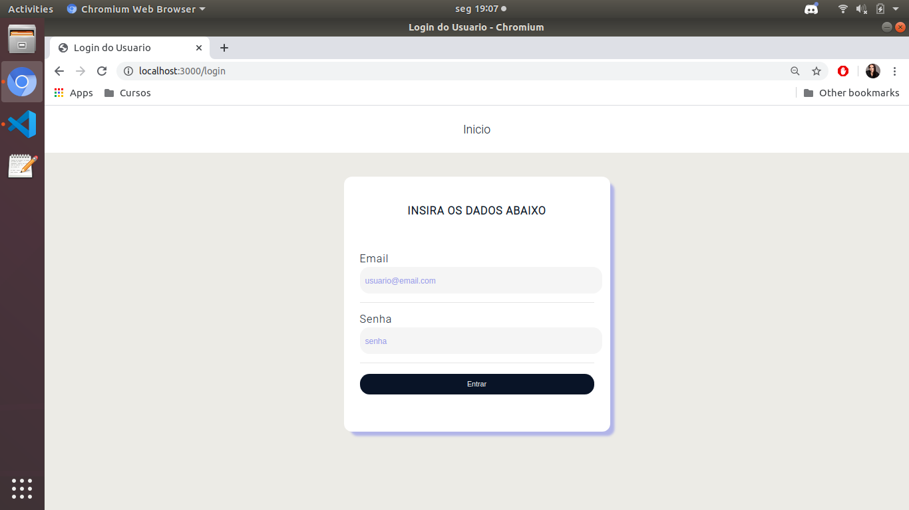
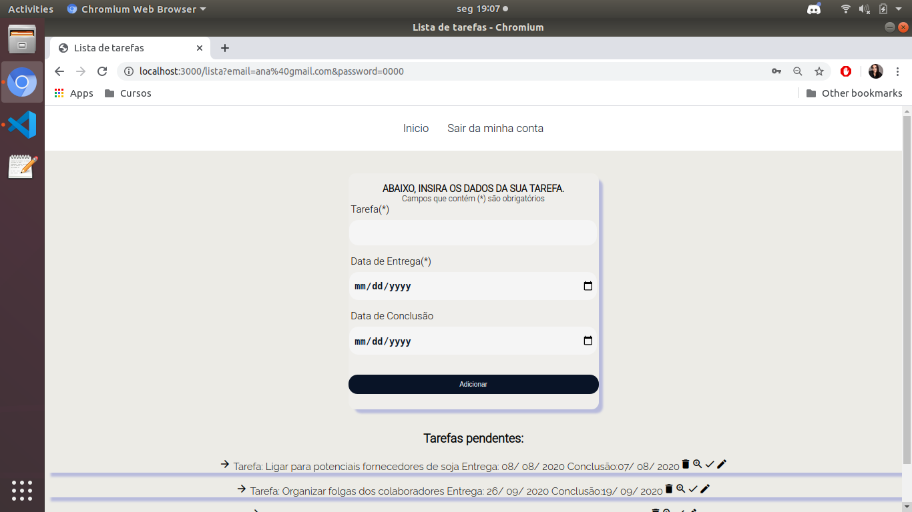
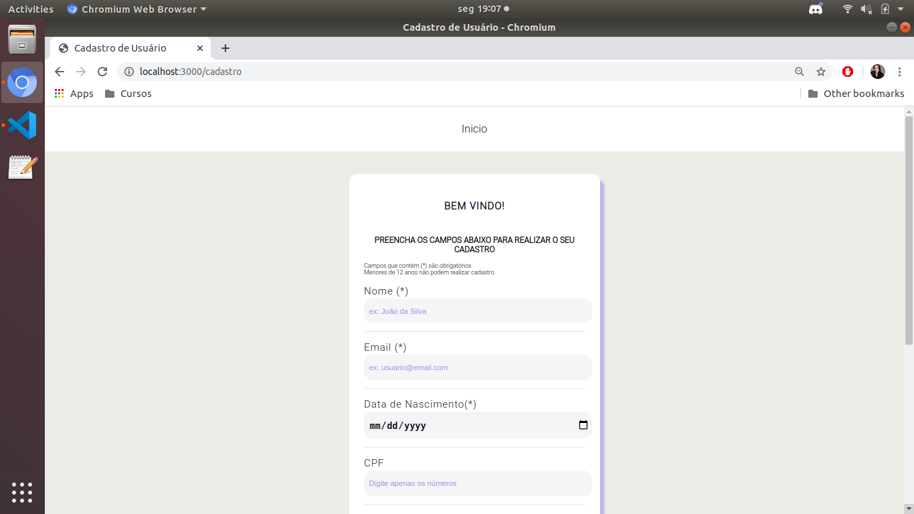
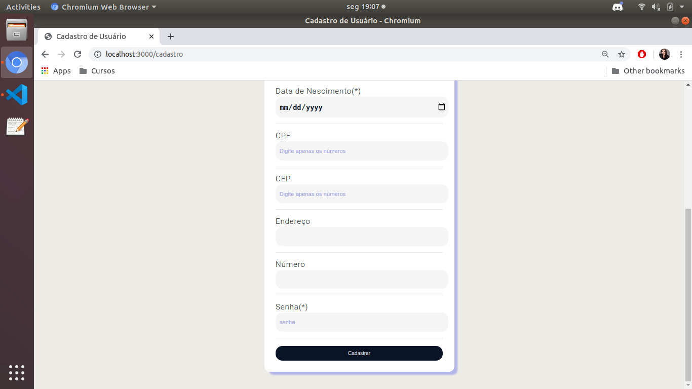

# Lista de tarefas - Desafio Verzel

## Descrição
Desafio técnico desenvolvido com objetivo de avaliação de conhecimentos em frontend. 

## Índice
- [Requisitos](#Requisitos)
- [Instalação](#Instalação)
- [Uso](#Uso)

## Requisitos
Para rodar a aplicação em ambiente de desenvolvimento, é necessário ter instalado:
- node.js
- npm  

### Dependencias de desenvolvimento utilizadas
- browser-sync
- express
- nodemon
- npm-run-all
- nunjucks

## Instalação
No terminal utilizar os comandos:
```
sudo apt install nodejs
```
e 
```
sudo apt install npm
```

## Uso
Para rodar a aplicação, utilizar o comando:
```
npm start 
```
- se tudo estiver ok, aparecerá no seu terminal a mensagem "server is ruunning" e o programa iniciará sozinho no localhost:3000

## Screenshots da aplicação


<p align="center">
  
</p>


<p align="center">
  
</p>

<p align="center">
  
</p>

<p align="center">
  
</p>

<p align="center">
  
</p>
